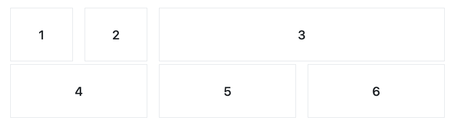
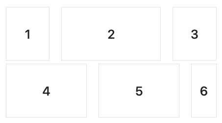

# CSS Frameworks: Grids

## Instructions

To complete this exercise, you will need to build a website with two rows and a total of six columns. There are two different views you will need to build depending on the screen size.

An `h2` element has been included for you that includes some styling. Place the `h2` inside of each column, updating the numbers to match with the screenshot.

### Desktop view

On a desktop, your website should look similar to the following. You can use the `md` breakpoint when deciding upon classes.

### Mobile view

On a smaller device, your layout should look similar to the following.

